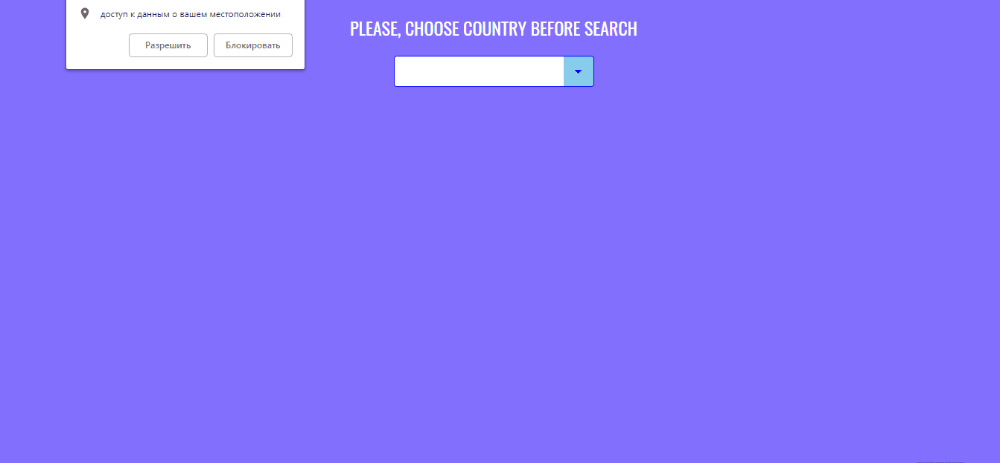

# vuejs-weather-app
> Погодное одностраничное веб-приложение

 https://vuejs-weather-app-32dde.firebaseapp.com

[![Build status][travis-image]][travis-url]  [![Dependency status][dependency-image]][dependency-url] 

При запуске приложение автоматически запрашивает погоду по координатам пользователя - это город/место по умолчанию. Прогноз выводится на 2 недели. Приложение позволяет добавлять и удалять собственные города. Удаление происходит путем нажатия на крестик в спике избранного, либо повторным нажатием на сердечко.

## Установка

<table>
  <thead>
    <tr>
      <th>Команда</th>
      <th>Результат</th>
    </tr>
  </thead>
  <tbody>
    <tr>
      <td width="30%"><code>npm install</code></td>
      <td>Установить зависимости</td>
    </tr>
    <tr>
      <td><code>npm run dev</code></td>
      <td>Запустить сборку, сервер и слежение за файлами</td>
    </tr>
     <tr>
      <td><code>npm run build</code></td>
      <td>Собрать проект для продакшена</td>
    </tr>
    <tr>
      <td><code>npm start ЗАДАЧА</code></td>
      <td>Запустить задачу с названием ЗАДАЧА (список задач в <code>package.json</code>)</td>
    </tr>
  </tbody>
</table>

Предполагается, что все команды вы выполняете в bash (для OSX и Linux это самый обычный встроенный терминал, для Windows это, к примеру, Git Bash). В Windows установку пакетов (npm i) нужно выполять в терминале, запущенном от имени администратора.

## Техническое задание 
<a href="https://gist.github.com/beshkenadze/bbe45d9b5263898cd784ce9fac4d7755" target="_blank">Открыть gist</a>

## Используемые технологии

<table>
  <thead>
    <tr>
      <th>Технология</th>
      <th>Описание</th>
    </tr>
  </thead>
  <tbody>
    <tr>
      <td><a href="https://ru.vuejs.org/index.html">Vue.js</a></td>
      <td>Основной фреймворк для разработки интерфейса приложения</td>
    </tr>
    <tr>
      <td><a href="https://vuex.vuejs.org/ru/">Vuex</a></td>
      <td>Центральное хранилище данных для всех компонентов приложения</td>
    </tr>
    <tr>
      <td><a href="https://ru.vuejs.org/v2/cookbook/using-axios-to-consume-apis.html">axios</a></td>
      <td>Доступ к API, основанный на промисах HTTP-клиента</td>
    </tr>
  </tbody>
</table>

## Поддержка браузерами

|   Edge |  Firefox |  Chrome |  Safari|  Opera |  Yandex |
| --------- | --------- | --------- | --------- |--------- | --------- |
| IE11, Edge|Последние 2 версии|Последние 2 версии| 9+ |Последние 2 версии| Последние 2 версии |

[travis-image]: https://travis-ci.org/webistomin/vuejs-weather-app.svg?branch=master
[travis-url]: https://travis-ci.org/webistomin/vuejs-weather-app
[dependency-image]: https://david-dm.org/webistomin/vuejs-weather-app/dev-status.svg
[dependency-url]: https://david-dm.org/webistomin/vuejs-weather-app
